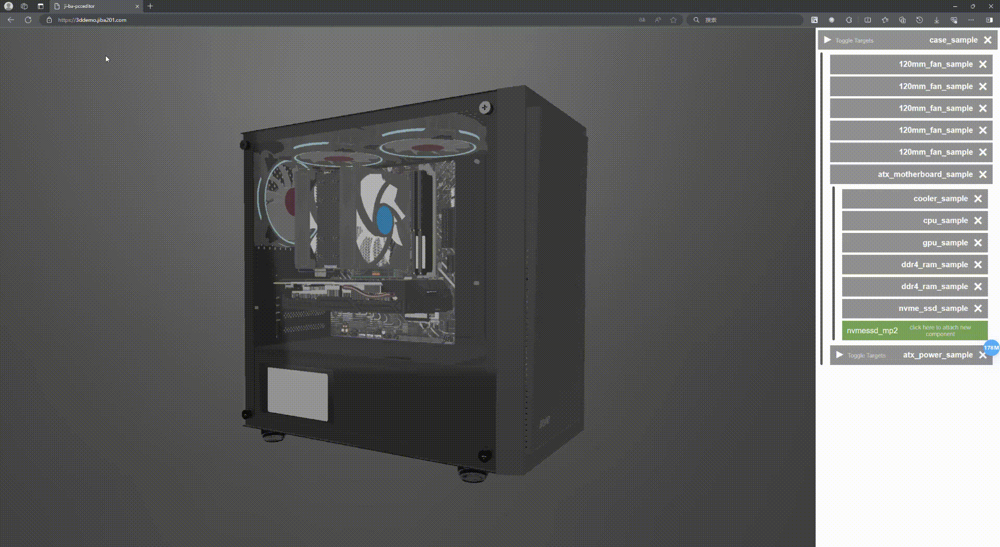

# [装机模拟器 - Web 版](https://3ddemo.jiba201.com)

[English](../README.md) | 简体中文

## 介绍

该项目参考自 Steam 中一款叫做 [PC Building Simulator](https://store.steampowered.com/app/621060/_PC_Building_Simulator/) 的游戏，旨在通过 3D 技术在浏览器中实现 PC Building Simulator 的沙盒模式，包括但不限于以下内容：

1. 通过选取不同的硬件，在浏览器中看到完整主机的 3D 模型
2. 通过触摸、长按等操作模拟真实的装机过程，包括螺丝拆卸、线缆安装等
3. 可以看到选取主机中的硬件配置和价格以及游戏兼容性、3Dmark 跑分等

## 开始

访问[我们的网站](https://3ddemo.jiba201.com)来获得真实的感受

## 贡献

我们欢迎所有对主机感兴趣的发烧友向此存储库提交 PR，包括模型和代码

### 贡献者

感谢这些了不起的人：

## 许可证

[CC BY-NC-ND 4.0](./LICENSE)
